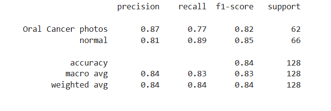
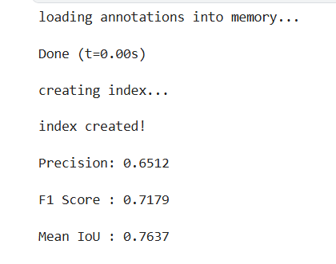

# Oral-cancer-detected
🧠 Project Summary

This project re-implements and extends the work from the paper titled:
“Automated Detection and Classification of Oral Lesions Using Deep Learning for Early Detection of Oral Cancer”.

The original study proposed using deep learning methods — specifically ResNet-101 for classification and Faster R-CNN for object detection — to identify oral potentially malignant disorders (OPMDs) using mobile phone images.

Due to resource constraints, we adapted their approach with lighter models and custom implementations while maintaining performance and interpretability.

🛠️ Design Choices & Implementation

🔹 Dataset

- **We used the Oral Cancer Images for Classification dataset from Kaggle.**

- **After cleaning (removing 40 corrupted images), we worked with 1,198 images.**

- **The images were categorized into two classes: lesion and no lesion.**

🔹 Image Classification

- **Instead of using ResNet-101, which was too heavy for our hardware, we:**

  - **Initially attempted ResNet-50 (also pre-trained on ImageNet).** 

  - **Eventually designed a custom CNN with ~456K trainable parameters.**

- **Training involved:**

  - **Input image size: 224x224**

  - **Loss: Binary Crossentropy**

  - **Optimizer: Adam**

  - **Batch size: 128**

  - **Epochs: 100**

  - **Augmentations: flipping, rotation, translation**

🔹 Object Detection

- **We implemented Faster R-CNN, similar to the paper.**

- **Used manual annotation with VIA (VGG Image Annotator).**

- **Achieved significantly better results than the paper (details below).**

📊 Results and Comparison
| Task               | Our Model               | Original Paper         |
|--------------------|--------------------------|------------------------|
| **Classification F1** | **82%** (Custom CNN)       | **87.07%** (ResNet-101) |
| **Detection F1**      | **71.79%** (Faster R-CNN)   | **41.18%** (Faster R-CNN) |
| **Mean IoU**         | **76.37%**                | Not Reported           |

🔍 Notes:

- **Our classification score was slightly lower, expected due to the use of a lighter model and a smaller dataset.**

- **Our detection score was much higher, likely due to:**

  - **Better data quality (Kaggle set had more consistency)**

  - **Clean annotations**

  - **Careful tuning**

🔹**Screenshots of the results:**
  - **Confusion matrix for the image classification part:**
    
  - **Classification report for the image classification part:**
    
  - **Classification report for the Lesion detection part:**
    
    
